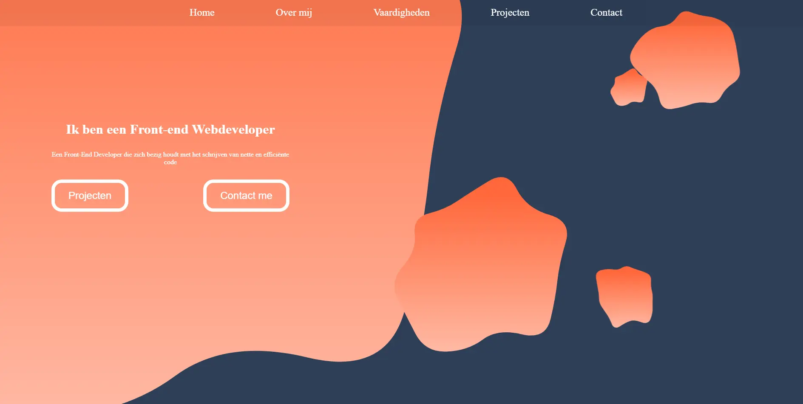
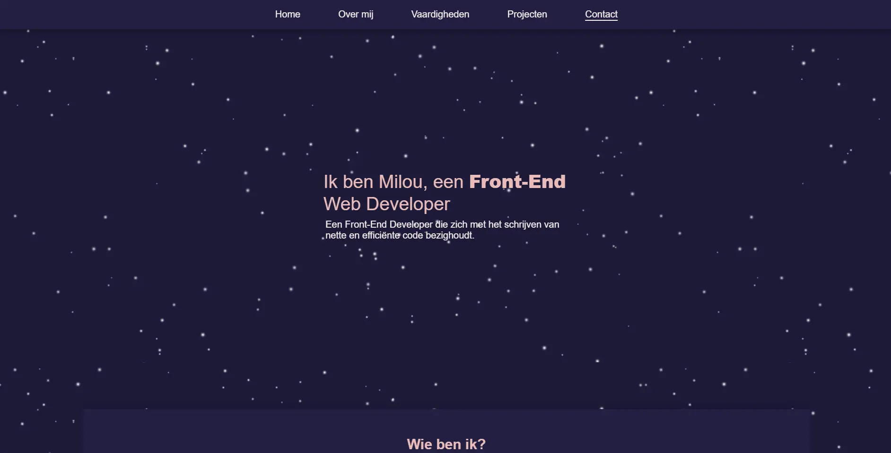
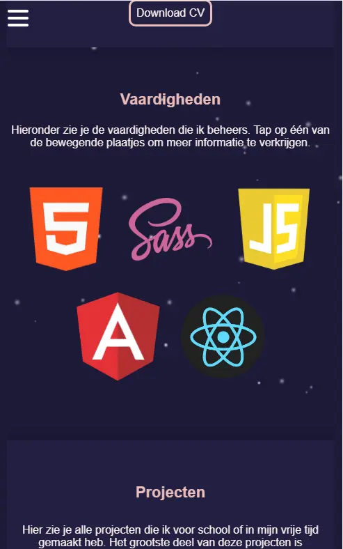

# portfolio-angular

## What to read here?
In this Readme you will read everything about me and how I made this portfolio step by step. 

## What programming languages have I used for this project?
For this project I have used Angular. The reason why I used Angular is because
I didn't wanted to make my portfolio the standard HTML, SCSS and Javascript.
Also I want to learn as much as possible and because we get React at school,
I thought it was nice to learn the basics of Angular by myself. 

## My first portfolio idea
Before the summer holiday I was looking for inspiration for my portfolio.
I have seen many portfolios that were amazing and this was one of my hardest challenges to make my creativity stand out.
I did not want to create my portfolio only with the things I have learned at school, but also something new that people barely use in my class.
In August I got my first idea and that was to make a portfolio with blobs. 
I created a wireframe with the design and while I was making the design, I got new ideas.
Each blob had to be different. For example one blob was fully colored while the other had only an outline.
Also each blob had a different animation.
I really liked the idea and I could not wait to code this.
A friend of mine works with Angular and I have learned so much. 
Just like: 
- how to setup an Angular project and to run it
- how to make components
- how to use events
- how to use @inputs() and @outputs()
- what interfaces are and how they work
- basically everything what I have wrote down in the Typescript
  
I am a perfectionist and while I was making the design I was not really happy about it.
The idea in my head seemed so much better than when I released it.
It looked a bit boring to me and it didn't seem like it came together.
Every blob has his own id with different inputs, so when it comes down to responsiveness,  
it was a disaster. When school started again, they told us to have finished the portfolio
begin October. I had two options, or I continue this project, fixed the problems and have bad code.
Or I start to make a new portfolio with a new design again. I had to planned to work on the portfolio for about a month.
Because I was not happy with my blobs I decided to start over again.
But if you like to see my code of blob portfolio, you can [click here](https://github.com/Milouyg/practice-angular).

# My second portfolio idea and final result
I started to look for inspirations and to make a wireframe again.
This time I did not want to make something really difficult, also I wanted
to make my portfolio as clear and minimalistic as possible.
And I did eventually. I would say the portfolio truly suits me, because it has a
calm feeling and not too much details, but still represent who I am.
Despite my first idea did not work out, I have learned so much from it.
I am really happy with the end result.

## Images
Blob portfolio

End result

